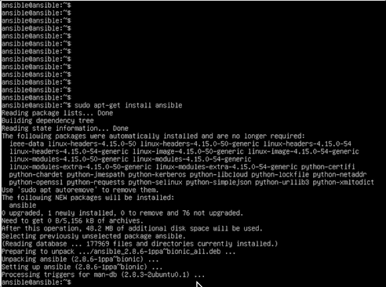
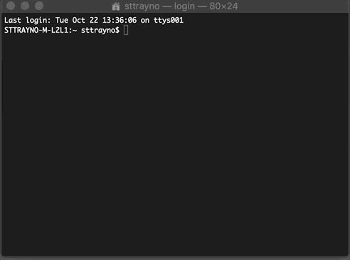
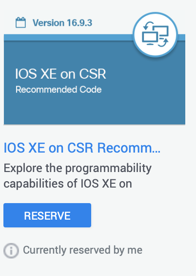
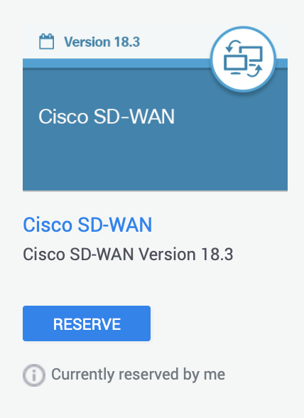

# Network Automation with Ansible - Crawl / Walk / Run

# Introduction

Ansible is one of the most popular configuration management and provisioning tools in use today. While it is mainly synonymous with server management, Ansible is being increasingly used for tasks on network infrastructure. The goal of this lab guide is to walk through some of the functionality of Ansible from a very much beginner starting point, working towards some of the more advanced functionality. The idea is to not just focus on the tooling, as this can vary but to look at Network Automation concepts including NETCONF/RESTCONF, Rest API's, controller based networking etc. The idea of this guide is to be delivered in tandem with trainer/presenter driven content, but has been created to be standalone where the student can do these exercises independently.

For people not familiar at all with this area, typical functionality of Ansible includes:

- Automate repetitive tasks to speed routine network changes and deployments
- Leverage the same automation tools for network tasks that operations and development use
- Benefit from community built example playbooks and roles to help accelerate development
- Communicate securely with network hardware over SSH or HTTPS

## Exercise 0 - Installing Ansible

Ansible is supported on Windows, MacOS and Linux platforms. In this exercise we'll explain the simple installation process on each platform to prepare our working environment. In the guide we'll use a Linux for exercises 1,2 and 3 but the commands across platforms should remain consistent. For detailed installation guides please use the guide provided by ansible (INSERT LINK HERE). 

For speed though you may wish to install Ansible on your day to day machine which is why we have also included instructions for MacOS and windows.

### Linux installation (via APT e.g. CentOS, Ubuntu etc)



The most common way to install Ansible on MacOS is through the `apt-get install ansible` command as shown. Again depending on user permissions you may have to use the `sudo` command


When the install completes, verify Ansible has been installed by running `Ansible` or `Ansible -h`

### MacOS Installation


The preferred way to install Ansible on MacOS is through the `pip install` command as shown. Again depending on user permissions you may have to use the `sudo` command



When the install completes, verify Ansible has been installed by running `Ansible` or `Ansible -h`

### Windows Installation - TBD

### Prerequisites

Before we get started with network automation we'll need a test environment, one of the easiest test environments you'll find is on the Cisco DevNet Sandbox which has multiple options. These are completely free and can in some cases be accessed within seconds. https://developer.cisco.com/docs/sandbox/#!overview/all-networking-sandboxes

Most popular sandboxes include:

- IOS-XE (CSR) - Always-On
- IOS-CR - Always-On
- Multi IOS test environment (VIRL based) - Reservation required
- Cisco SD-WAN environment - Always-On
- Cisco DNA-C environment - Always-On

Please note you are free to use this with your own hardware or test environment. However the commands in this lab guide have been tested for the sandboxes they correspond to. For this lab guide we will be using the reservable IOS XE on CSR Recommended Code Sandbox which can be found on the Sandbox catalogue https://devnetsandbox.cisco.com/RM/Topology



## Exercise 1 (Crawl) - Simple device feature configuration with Ansible and building our first playbook (CISCO IOS)

One of the fundamental concepts of Ansible are playbooks. Playbooks are one of the core features of Ansible and tell Ansible what to execute. They are like a to-do list for Ansible that contains a list of tasks. Playbooks are the files where Ansible code is written. Playbooks are written in YAML format. YAML stands for Yet Another Markup Language. See them as like a to-do list for Ansible that contains a list of tasks.

Playbooks contain the steps which the user wants to execute on a particular machine. Playbooks are run sequentially. Playbooks are the building blocks for all the use cases of Ansible. It's important to note that playbooks normally utilise modules, these modules normally define the functionality of your playbook and what systems and features your playbook will execute on, we'll cover a few in this guide but for a more complete list see the modules index hosted on the Ansible site https://docs.ansible.com/ansible/latest/modules/modules_by_category.html

In this exercise we are going to create our own Ansible playbook to push a configuration to our sandbox. If this is an instructor based lab this may be shared environment which we're going to have multiple people accessing the same box therefore we'll configure a unique loopback interface on the device, to avoid people editing the same configuration.

NOTE: Your instructor should assign you a number to use in your config for this lab, keep a note of it as we'll use it later on. if you're doing this self paced just you're welcome to use whatever number you'd like.

### Step 1 - Creating our Ansible inventory

Before we can build our playbook, we must define the devices we are going to be working with in the ansible host file. The good news is this is nice and simple to start off. On a Linux system this can be found in /etc/ansible/hosts. When you get access to the file with a text editor, for example on Ubuntu you can use `vi /etc/ansible/hosts` Once you have access to the hosts file add the below lines.

```yaml
[test-router]
10.10.20.48
```

The square brackets in an Ansible host file denotes the group name, which is then followed by the IP address or hostnames of the devices in the group. Groups can be referenced within a playbook to decide which hosts a playbook will run against.

Note: There are two default groups: all and ungrouped. The all group contains every host. The ungrouped group contains all hosts that don’t have another group aside from all.

For more detail on Ansible inventories please refer to the Ansible Documentation which discusses this in more detail. https://docs.ansible.com/ansible/latest/user_guide/intro_inventory.html

### Step 2 - Creating our ansible playbook

As mentioned earlier one of the main components of an Ansible playbook are the modules, the main module we'll explore in this exercise is the ios_config module. This allows network engineers to use access Cisco network devices and push Cisco IOS configuration to devices, which can be configured to support multiple use cases some of which you're probably thinking of already! In further exercises we'll explore more of these modules but to get started we'll use the ios_config module.

To get started create a file called deploy-loopback.yaml and paste in the below config, alternatively you can use the pre-made deploy-interface.yaml file which is contained within this repo under the ansible-playbooks folder. Examine the file and try to understand what its looking to do

```yaml
---
- hosts: test-router
  gather_facts: false
  connection: local

  tasks:
    - name: configure loopback interface
      ios_config:
        lines:
          - description Loopback1208 created with ansible
          - ip address 1.1.1.1 255.255.255.0
        parents: interface Loopback1208
```

Once you have your playbook build it's now time to run it. To do this we'll use the `ansible-playbook` command, to run this successfully and authenticate properly use the argument -u and -k to ask the user for a SSH password before the playbook executes. `ansible-playbook deploy-loopback.yaml -u developer -k`

It is possible to specify passwords and usernames and variables within the inventory but we'll cover that at a later time.


After the playbook runs ssh into the CSR and run show run to verify the loopback interface has been created.


Well done, you've ran your first ansible playbook!

### Stretch exercise - Additional playbooks

Within the ansible-playbooks folder there are some additional playbooks: change-snmp.yaml and get-backup.yaml. Explore the contents of these and run them with the `ansible-playbook -u developer <playbook name> -k` command.

## Exercise 2 (Walk) - SD-WAN configuration playbooks with Ansible 

Now we've got to grips with the components on Ansible lets begin to get a little more advanced, we've shown that with Ansible we are able to SSH into any Cisco device and with the right module can implement a configuration (WLC, ASA, NXOS, IOS, IOS-XE. This helps us solve the age old problem that's existed about moving away from box to box configuration. That being said, controller based networking solutions which take a system wide view of the network are becoming more and more popular. We can also utilise configuration tools such as Ansible in a controller based envrionment.

As we did in exercise 1, you are free to use this with your own hardware or test environment. However the commands in this lab guide have been tested for the sandboxes they correspond to. For this lab guide we will be using the reservable Cisco SD-WAN  reservable sandbox which can be found on the sandbox catalogue https://devnetsandbox.cisco.com/RM/Topology



With controller based networking such as SD-WAN, we will either typically use either a specific module built for that platform (as we did in the IOS examples) or we will use the REST API, . As Cisco's SD-WAN doesn't have an Ansible module specifically built for it, we'll use the REST API with Ansible playbooks to look at autating specific tasks.

```Note: Configuration can be performed from its graphical user interface vManag. However vManage also offers a rich REST API. This enables the end user to automate specific workflows using favorite tools as we're exploring in this exercise```

## Exercise 3 (Run) - CI/CD pipeline with SD-WAN and Ansible

Comming soon...
